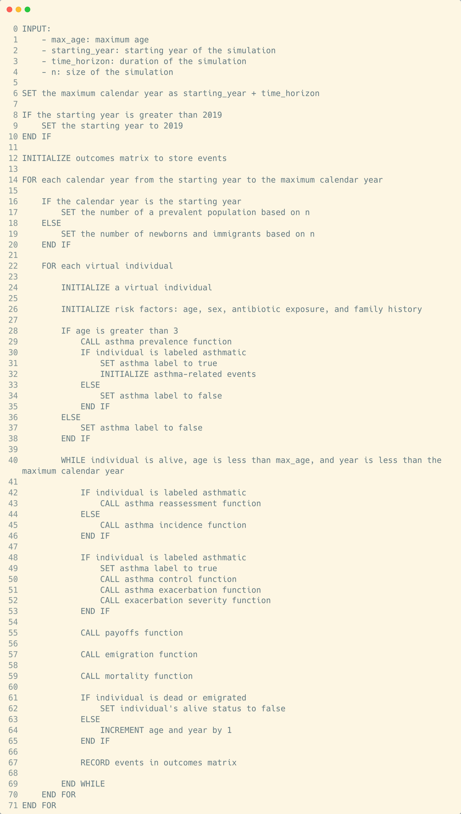

# Lifetime Exposures and Asthma outcomes Projection (LEAP)

Documentation for LEAP will be available by the end of 2023.

Here is the pseudo-code of the model:



# Developers

## Installation

To install this package on your computer locally, first download it from `GitHub`:

```
git clone https://github.com/resplab/LEAP.jl
```

Next, install the package:

```
cd LEAP.jl
julia
> import Pkg
> Pkg.add(path="PATH_TO/LEAP.jl")
```

## Dependencies

To add dependencies, you can add them to the `LEAP.jl` file:

```
using MyDependency
```

For the dependencies to be included in the package, you need to also add them to the `Project.toml`
file. To do so, open a terminal and enter the `Julia` package `REPL`:

```
cd LEAP.jl
julia
julia> # type ] here to enter the Pkg REPL
[(@v1.x) pkg> activate . # activate our package REPL
[(LEAP) pkg> add MyDependency
```

## Tests

```
cd LEAP.jl
julia
julia> # type ] here to enter the Pkg REPL
[(@v1.x) pkg> activate . # activate our package REPL
[(LEAP) pkg> test
```
